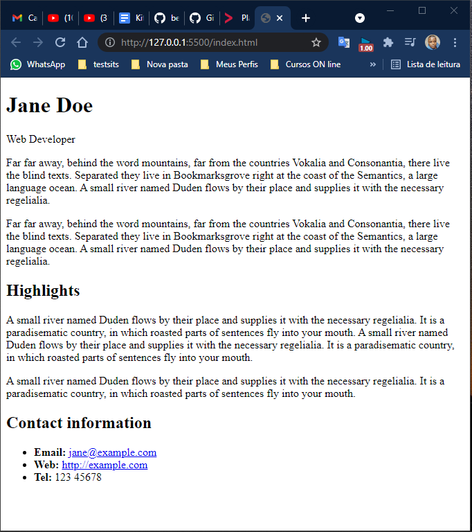

<h1>Mesa de Trabalho - HTML / CSS</h1>

<h2>Curso: Certified Tech Deveçlop - Digital House</h2>
<h2>Disciplina: Front End I</h2>
<h2>Turma 01 NT</h2>
<h2>Aula 07</h2>

Aula pratica estilizando uma pagina HTML com CSS

<h2>Antes</h2>

<h2>Depois</h2>

