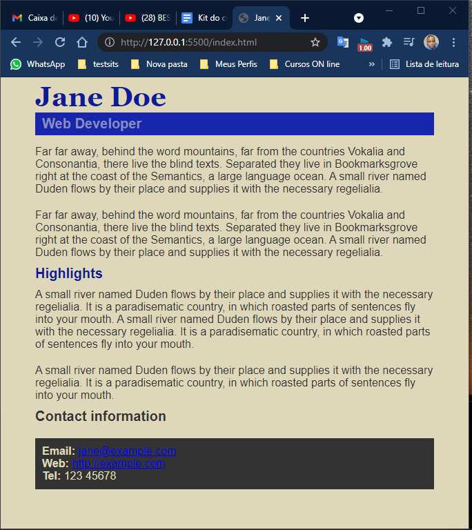

<h1>Mesa de Trabalho - HTML / CSS</h1>

Curso: Certified Tech Deveçlop - Digital House

Disciplina: Front End I

Turma 01 NT

<h3>Aula 07</h3>

Aula pratica estilizando uma pagina HTML com CSS

<h3>Antes</h3>

<h3>Depois</h3>

